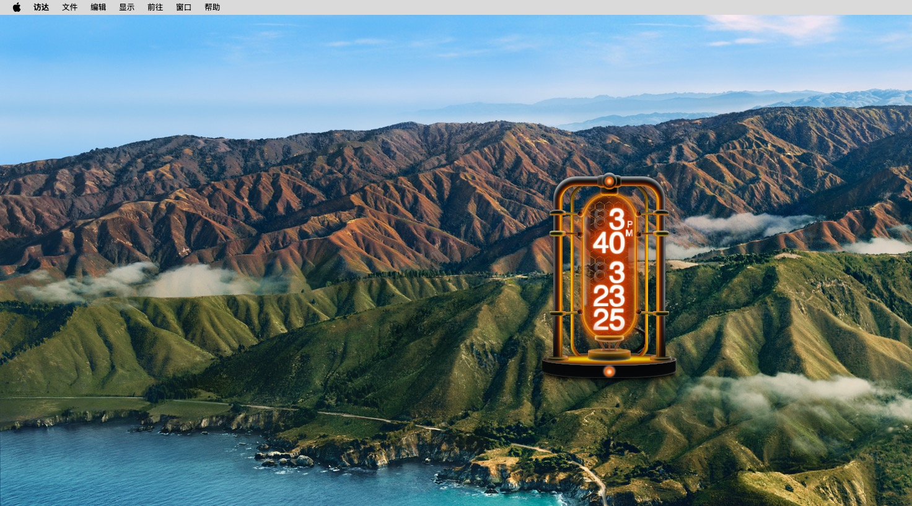
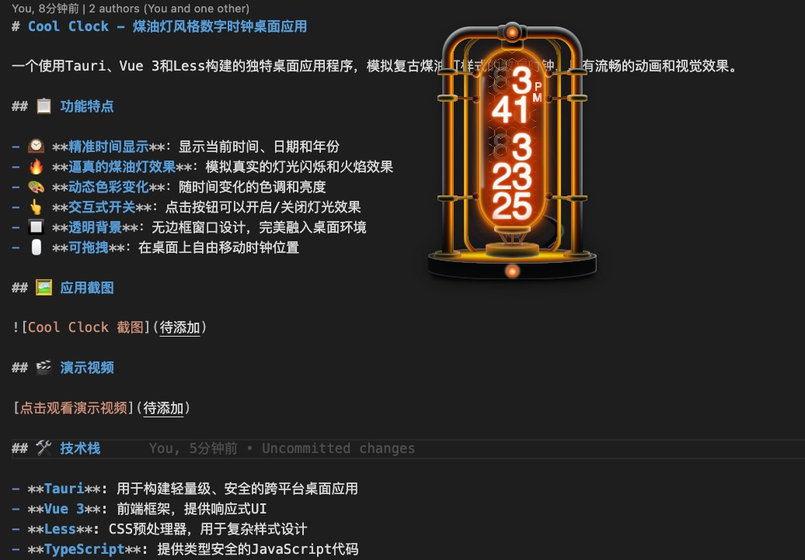

# Cool Clock - 煤油灯风格数字时钟桌面应用

一个使用Tauri、Vue 3和Less构建的独特桌面应用程序，模拟复古煤油灯样式的数字时钟，具有流畅的动画和视觉效果。

## 📋 功能特点

- 🕰️ **精准时间显示**：显示当前时间、日期和年份
- 🔥 **逼真的煤油灯效果**：模拟真实的灯光闪烁和火焰效果
- 🎨 **动态色彩变化**：随时间变化的色调和亮度
- 👆 **交互式开关**：点击按钮可以开启/关闭灯光效果
- 🔲 **透明背景**：无边框窗口设计，完美融入桌面环境
- 🖱️ **可拖拽**：在桌面上自由移动时钟位置

## 🖼️ 应用截图




## 🎬 演示视频

[点击观看演示视频](./assets/video.mp4)
1. 视频链接方式（适用于大多数平台）：
[观看演示视频](./assets/video.mp4)

2. 使用HTML标签方式（在某些支持HTML的平台上可能有效）：
<video src="./assets/video.mp4" controls width="640"></video>

3. 使用视频截图+链接方式：
[]

## 🛠️ 技术栈

- **Tauri**: 用于构建轻量级、安全的跨平台桌面应用
- **Vue 3**: 前端框架，提供响应式UI
- **Less**: CSS预处理器，用于复杂样式设计
- **TypeScript**: 提供类型安全的JavaScript代码

## ⚙️ 安装与使用

### 安装依赖

```bash
# 使用npm
npm install

# 或使用pnpm
pnpm install
```

### 开发模式

```bash
npm run tauri dev
# 或
pnpm tauri dev
```

### 构建应用

```bash
npm run tauri build
# 或
pnpm tauri build
```

### 发布应用
```bash
git tag v0.1.0
git push origin v0.1.0
```

## 📝 文档

## 🧩 应用结构

- `src/`: 前端Vue代码
  - `components/KeroseneLamp.vue`: 煤油灯时钟组件
- `src-tauri/`: Tauri后端代码
- `public/`: 静态资源

## 🔍 主要特性解析

### 煤油灯闪烁效果

应用使用CSS变量和JavaScript计时器创建动态闪烁效果，模拟真实煤油灯的光线变化：

- 偶数秒和奇数秒有不同的亮度
- 每10秒会有一次明显的亮度变化
- 每5秒钟色调会发生细微变化

### 无边框透明窗口

使用Tauri的透明窗口功能，创建无边框、可拖拽的应用界面，增强桌面集成感。

## 🤝 贡献

欢迎提交问题和改进建议！随时可以：

1. Fork 项目
2. 创建功能分支 (`git checkout -b feature/amazing-feature`)
3. 提交更改 (`git commit -m '添加了一些惊人的功能'`)
4. 推送到分支 (`git push origin feature/amazing-feature`)
5. 打开Pull Request

## 📄 许可证

[MIT](LICENSE)

## 联系方式
- 邮箱：994129509@qq.com
- 网站：[您的网站](https://ink-home.cn)
